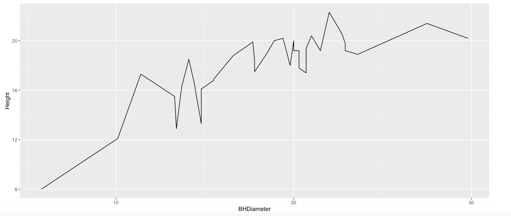
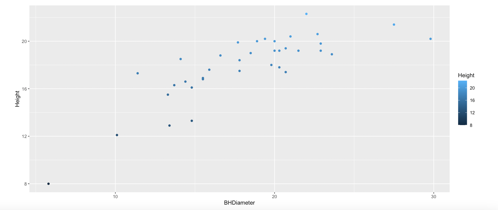
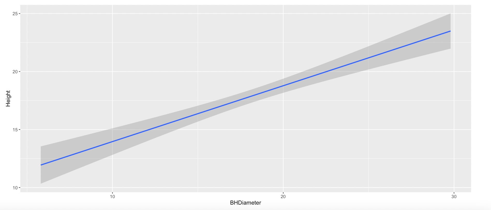

```{r setup, include=FALSE}
knitr::opts_chunk$set(echo = TRUE)
```

# Tasks

## Task1
```{r}
getwd()
```

## Task2
```{r}
s <- read.csv("SPRUCE.csv")
head(s)
```

## Task3
```{r}
plot(s$Height~s$BHDiameter,main = "Height vs Diam", xlab = "BHDiameter", ylab="Height",pch= 21,bg = "blue", cex = 1.2, ylim = c(0, max(s$Height*1.1)),xlim=c(0, max(s$BHDiameter*1.1)))
```

I think the graph has more of a curve relationship than a straight line.

```{r}
library(s20x)

layout(matrix(1:3,byrow = TRUE, nrow = 1, ncol = 3))

trendscatter(s$Height~s$BHDiameter, f= 0.5, ylab = "Height", xlab = "BHDIAMETER")
trendscatter(s$Height~s$BHDiameter, f= 0.6,ylab = "Height", xlab = "BHDIAMETER")
trendscatter(s$Height~s$BHDiameter, f= 0.7, ylab = "Height", xlab = "BHDIAMETER")

```


```{r}
spruce.lm = with(s, lm(Height~BHDiameter))
plot(s$Height~s$BHDiameter,main = "Height vs Diam", xlab = "BHDiameter", ylab="Height",pch= 21,bg = "blue", cex = 1.2, ylim = c(0, max(s$Height*1.1)),xlim=c(0, max(s$BHDiameter*1.1)))
abline(spruce.lm)
```

Still, the straight line is not as fitting as a curved line would be.

## Task4

```{r}
layout(matrix(1:4,nr = 2, nc = 2, byrow = TRUE))
layout.show(4)
```

```{r}
layout(matrix(1:4,nr = 2, nc = 2, byrow = TRUE))
mycex = 1.0
spruce.lm = with(s, lm(Height~BHDiameter))
plot(s$Height~s$BHDiameter,main = "Height vs Diam", xlab = "BHDiameter", ylab="Height",pch= 21,bg = "blue", cex = 1.2, ylim = c(0, max(s$Height*1.1)),xlim=c(0, max(s$BHDiameter*1.1)))
abline(spruce.lm)
sf = fitted(spruce.lm)


plot(s$Height~s$BHDiameter,main = "RSS", xlab = "BHDiameter", ylab="Height",pch= 21,bg = "blue", cex = 1.2, ylim = c(0, max(s$Height*1.1)),xlim=c(0, max(s$BHDiameter*1.1)))

with(s, {segments(BHDiameter, Height, BHDiameter,fitted(spruce.lm),col = "red")})
abline(spruce.lm)

plot(s$Height~s$BHDiameter,main = "MSS", xlab = "BHDiameter", ylab="Height",pch= 21,bg = "blue", cex = 1.2, ylim = c(0, max(s$Height*1.1)),xlim=c(0, max(s$BHDiameter*1.1)))

abline(h = mean(s$Height))

segments(s$BHDiameter,mean(s$Height),s$BHDiameter,fitted(spruce.lm), col = "green")
abline(spruce.lm)

plot(s$Height~s$BHDiameter,main = "TSS", xlab = "BHDiameter", ylab="Height",pch= 21,bg = "blue", cex = 1.2, ylim = c(0, max(s$Height*1.1)),xlim=c(0, max(s$BHDiameter*1.1)))

abline(h=mean(s$Height))
segments(s$BHDiameter,s$Height,s$BHDiameter,mean(s$Height), col = "blue")
```

RSS

```{r}
sum((s$Height - fitted(spruce.lm)) ^ 2)
```

MSS
```{r}
sum((fitted(spruce.lm) - mean(s$Height))^2)
```

TSS
```{r}
sum((s$Height - mean(s$Height))^2)
```

MSS/TSS
```{r}
(sum((fitted(spruce.lm) - mean(s$Height))^2))/(sum((s$Height - mean(s$Height))^2))

```

The number represents R^2, which shows how fit the data is to the regression line - .65 is too low to use a straight line of fit for the data.

RSS + MSS = TSS
```{r}
sum((s$Height - fitted(spruce.lm)) ^ 2) + sum((fitted(spruce.lm) - mean(s$Height))^2)

sum((s$Height - mean(s$Height))^2)

```

RSS + MSS does equal TSS.

## Task5

Summary
```{r}
summary(spruce.lm)
```

Coef
```{r}
coef(spruce.lm)
```

Slope is the BHDiameter value, or .4814743. Intercept is the intercept value, or 9.1468390.

The equation of the fitted line would be

0.4815x + 9.1468


```{r}
predict(spruce.lm, data.frame(BHDiameter = c(15,18,20)))
```


## Task6

```{r}
library(ggplot2)

g = ggplot(s, aes(x = BHDiameter, y = Height, color = BHDiameter)) + geom_point() + geom_line() + geom_smooth(method = "lm") + ggtitle("Height vs BreastD")
g
```

## Task7
{ width=70% }
{ width=70% }
{ width=70% }


```{r}
ss <- read.csv("SEEDLING.csv")
sss <-with(ss,table(Abundance, Type))
addmargins(sss)
```

